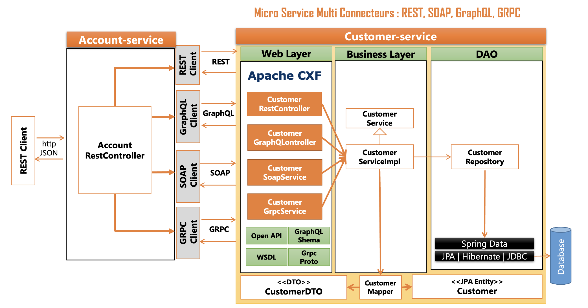

# micro-service-multi-connecteurs-rest-graphql-soap-grpc

Spring Boot - Micro Service Multi Web services APIs - REST, GraphQL, SOAP GRPC

Using : 
- Spring Boot 3.1.1
- Java 17
- Record
- DTO
- Mapper
- Swagger
- lombok
- H2 Database
- graphql
- cxf : pour déployer le ws soap dans un contenur spring

# Project Architect

